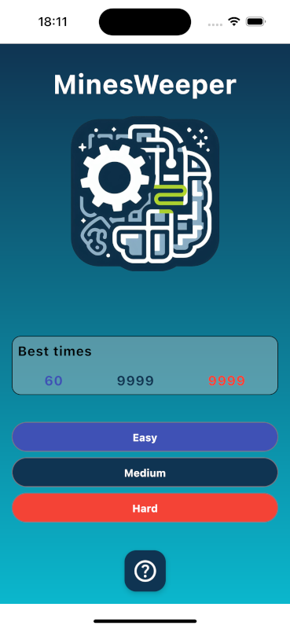
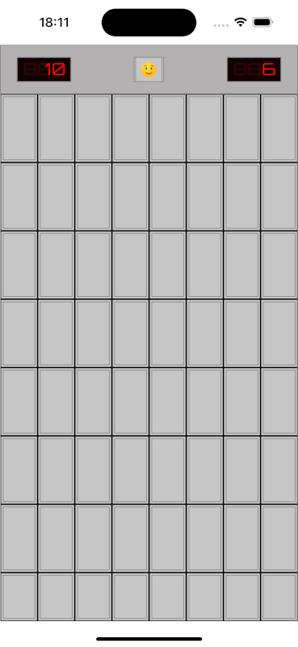

  

---

# MinesWeeper
This is my version of the classic game Minesweeper, developed in Kotlin.
** Updated to Compose Multi Platform**
This game is available in Android and IOS

The original version of this project is available on the brach **Kotlin**

## Main Features and Technologies Used
- **Kotlin 2.0**: It is used to take advantage of its modern features and performance improvements, making it easier to develop a robust and efficient application.
- **Jetpack Compose**: The user interface is developed using this modern Android UI toolkit, making it easy to create flexible and dynamic interfaces.
- **MVVM**: Implements the Model-View-ViewModel pattern to separate presentation logic from business logic and data, improving testability and code organization.
- **Dependency Injection - Koin ~~Dagger-Hilt~~ **: Used to simplify dependency management, allowing for better scalability and unit testing.
- **Unit Test**: User interface tests to ensure the app behaves correctly and provides a smooth user experience.
- **Flows**: Utilized to handle asynchronous data streams, providing a clean way to manage state and data flow within the application.
- **DataStore Preferences**: It is used to save the best times of the user locally

---

## Screenshots

|  |  |
|:---------------------------------------:|:--------------------------------------:|
|                 **Home**                |                **Game**                |
|  |  |
|:---------------------------------------:|:--------------------------------------:|
|                 **IOS Menu**                |                **IOS Game**                |
|  |  |
|:----------------------------------------------:|:------------------------------------------------:|
|                 **Game Win**                   |                 **Game Loss**                    |

---

## ToDo List

- [X] End of game **status**
- [X] Dialog Status End of Game
- [X] Toast for alerts, only when the user has no more mines
- [X] Animations, only in dialogs
- [X] Persistence for saving records
- [X] Show records on HomeScreen
- [X] Board test created

---
