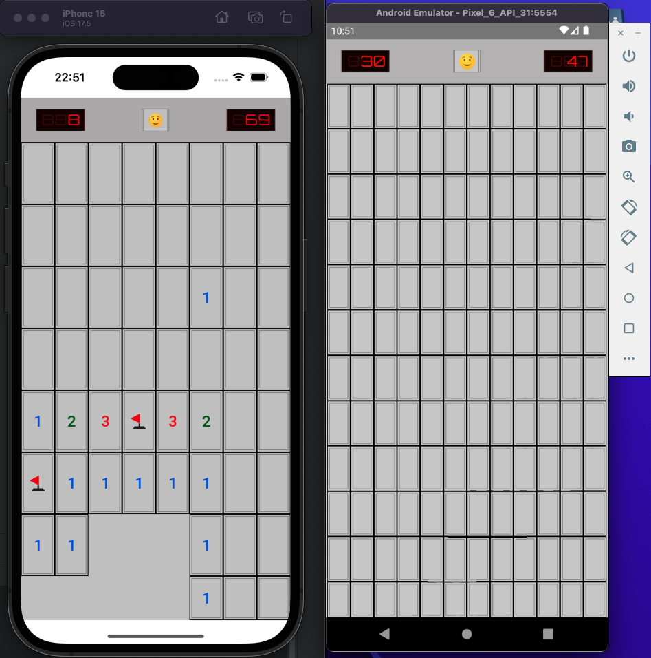
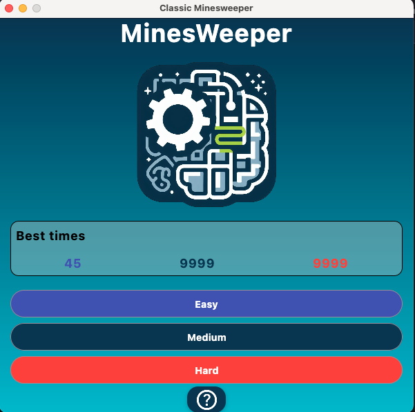
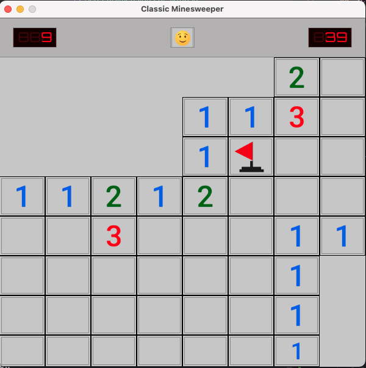

  

---

# MinesWeeper

This is my version of the classic game Minesweeper, developed in Kotlin.

**Updated to Compose Multi Platform**: This game is now available on Android, iOS and Desktop.

The original version of this project with the Android version is available on the branch [**Kotlin**](https://github.com/kmorfo/MinesWeeper/tree/Kotlin).

## Main Features and Technologies Used

- **KMP**: Compose Multi Platform
- **Kotlin 2.0**: Utilized for its modern features and performance improvements, making it easier to develop a robust and efficient application.
- **Jetpack Compose**: The user interface is developed using this modern Android UI toolkit, enabling the creation of flexible and dynamic interfaces.
- **MVVM**: Implements the Model-View-ViewModel pattern to separate presentation logic from business logic and data, improving testability and code organization.
- **Dependency Injection - Koin** ~~(formerly Dagger-Hilt)~~: Simplifies dependency management, allowing for better scalability and unit testing.
- **Unit Testing**: User interface tests ensure the app behaves correctly and provides a smooth user experience.
- **Flows**: Handles asynchronous data streams, providing a clean way to manage state and data flow within the application.
- **DataStore Preferences**: Used to save the user's best times locally.

---

## Screenshots mobile

|                    **Home**                     |                 **Game**                  |
| :---------------------------------------------: | :---------------------------------------: |
|          |    |
|                  **iOS Menu**                   |               **iOS Game**                |
|          |    |
|                  **Game Win**                   |               **Game Loss**               |
|          |  |
|                **Both Systems**                 |                                           |
|  |                                           |

---
## Screenshots desktop
|                    **Home**                     |                 **Game**                  |
| :---------------------------------------------: | :---------------------------------------: |
|          |    |
---

## To-Do List

- [x] App Icon on iOS and Android
- [x] Convert to KMP
- [x] End of game **status**
- [x] Dialog for End of Game Status
- [x] Toast alerts when the user has no more mines
- [x] Animations in dialogs
- [x] Persistence for saving records
- [x] Show records on HomeScreen
- [x] Board test created
- [x] Desktop version

---
