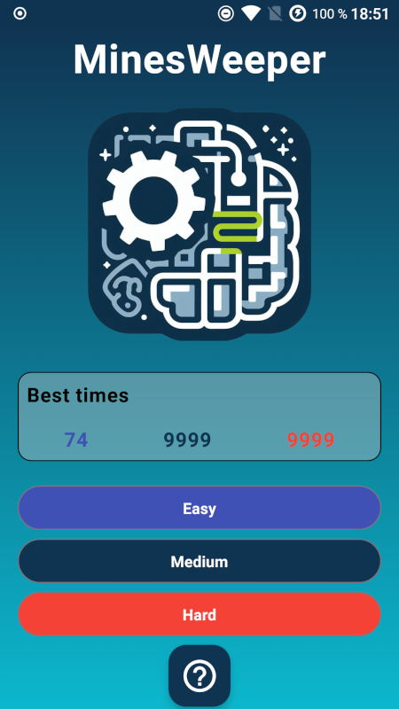
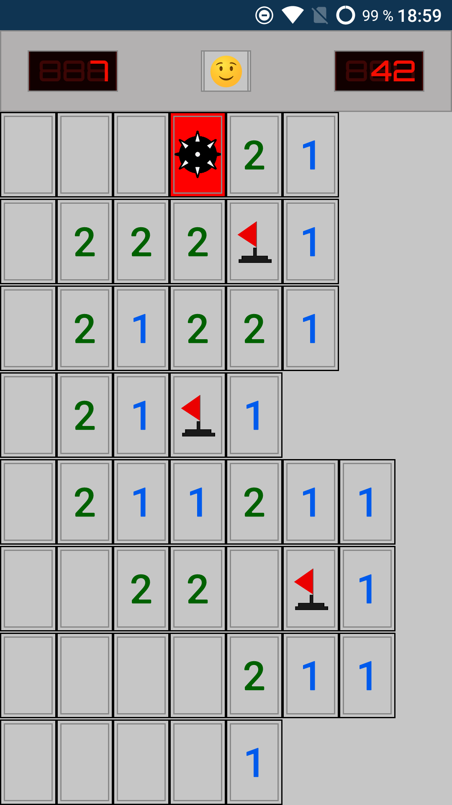
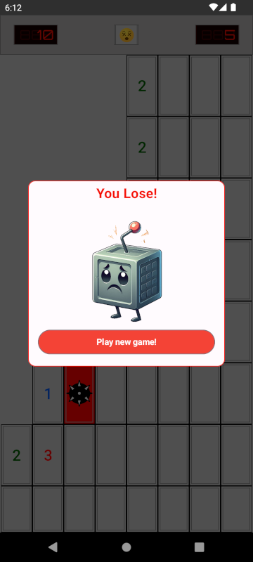
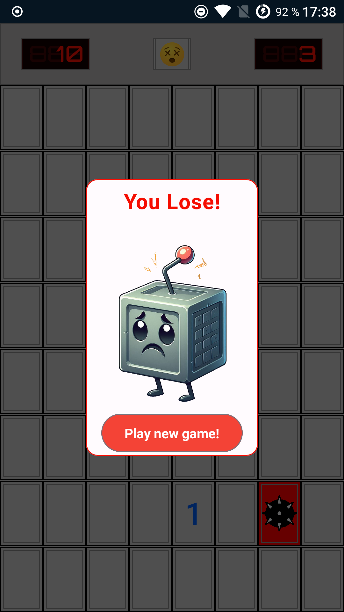

  

# MinesWeeper
This is my version of the classic game minesweeper developed in kotlin

## ToDo List
- [ X ] End of game **status**
- [ X ] Dialog Status End of Game
- [ X ] Toast for alerts. Only when the user has no more mines
- [ X ] Animations. Only in Dialogs
- [ X ] Persistence for save records
- [ X ] Show records on HomeScreen
- [ X ] Board Test Created

# Screenshots

